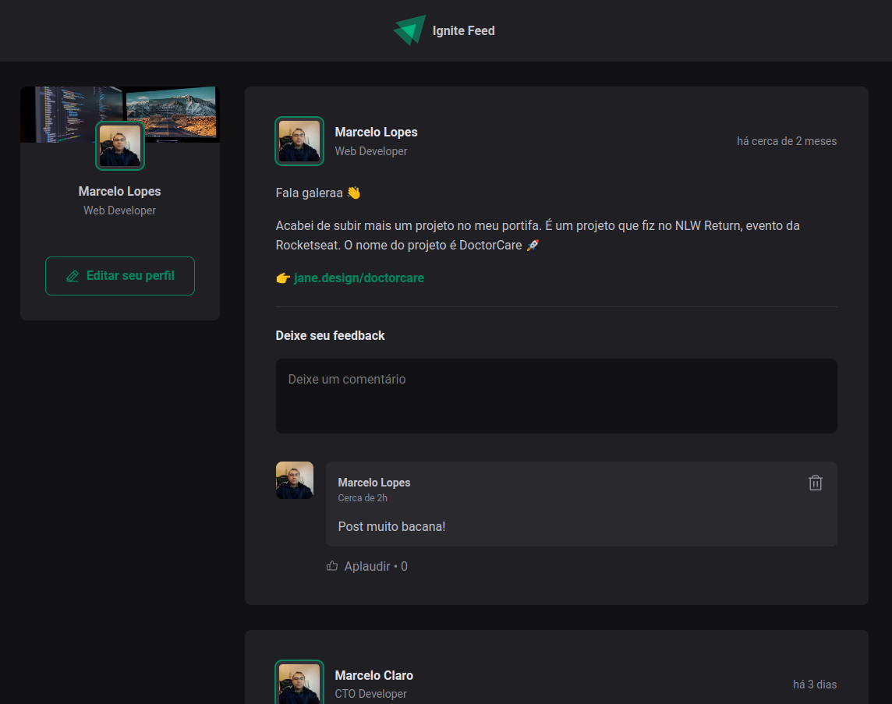
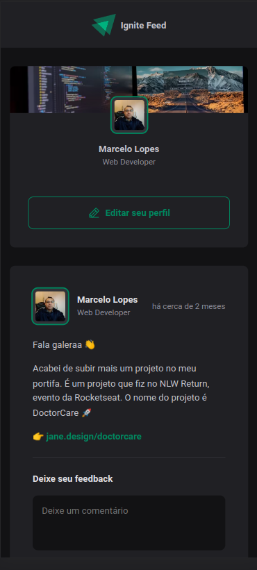

# Ignite Feed

Aplicação de posts em ReactJS usando o framework Vitejs, da Jornada do Ignite Rocketseat, instrutor Diego Fernandes. Tecnologias usadas:

#### tecnologias:

- typescript
- phosphor-react
- date-fns

---

## Screenshot

 

---

💜 Ignite Trilha ReactJS 2022
